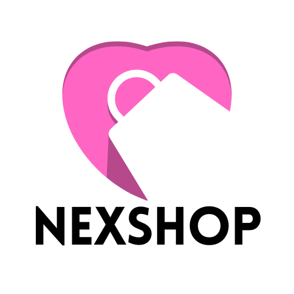

<a name="readme-top"></a>


<!-- PROJECT LOGO -->
<br />
<div align="center">
  <a href="https://github.com/MrSingh2000/NexShop">
    
  </a>

  <p align="center">
    NextJS shopping application
    <br />
    <a href="https://github.com/MrSingh2000/NexShop/issues">Report Bug</a>
    ·
    <a href="https://github.com/MrSingh2000/NexShop/issues">Request Feature</a>
  </p>
</div>

<!-- TABLE OF CONTENTS -->
<details>
  <summary>Table of Contents</summary>
  <ol>
    <li>
      <a href="#about-the-project">About The Project</a>
      <ul>
        <li><a href="#built-with">Built With</a></li>
      </ul>
    </li>
    <li>
      <a href="#getting-started">Getting Started</a>
      <ul>
        <li><a href="#prerequisites">Prerequisites</a></li>
        <li><a href="#installation">Installation</a></li>
      </ul>
    </li>
    <li><a href="#contact">Contact</a></li>
  </ol>
</details>

<!-- ABOUT THE PROJECT -->

## About The Project

NextJS shopping application.

Features covered :-

- Authentication
- Image upload using cloudinary API
- Product's distinguished by category
- Cart feature

Its an open source project, feel free to fork the repo and just start working on your local machine!

<p align="right">(<a href="#readme-top">back to top</a>)</p>

### Built With

- [](https://nextjs.org/)
- [](https://www.mongodb.com/)

<p align="right">(<a href="#readme-top">back to top</a>)</p>

<!-- GETTING STARTED -->

## Getting Started

Set up the project locally on your system following instructions on setting up your project.
To get a local copy up and running, follow these simple steps.

### Prerequisites

Installing latest Package Manager

- npm
  ```sh
  npm install npm@latest -g
  ```
- yarn
  ```sh
  yarn install yarn@latest -g
  ```

### Installation

1. Clone the repo
   ```sh
   git clone https://github.com/MrSingh2000/NexShop.git
   ```
2. Installing required packages

   Server

   ```sh
   npm install
   ```

3. Setting up environment variables in `.env`

   Server side env variables

   ```txt
   MONGO_URI=_Mongo_URI_
   SECRET_KEY=_JWT_SECRET_
   NEXT_PUBLIC_API_URL=http://localhost:3000
   NEXT_PUBLIC_CLOUDINARY_UPLOAD_URL=https://api.cloudinary.com/v1_1/<cloud_name>
   NEXT_PUBLIC_CLOUDINARY_CLOUDNAME=_cloud_name_
   NEXT_PUBLIC_CLOUDINARY_API_KEY=_api_key_
   NEXT_PUBLIC_API_SECRET=kC-_secret_key_
   CLOUDINARY_API_SECRET=_api_secret_
   ```

4. Start the application

    server

    ```sh
    npm run dev
    ```

<p align="right">(<a href="#readme-top">back to top</a>)</p>

# Contributing to the Project

Welcome! We're thrilled that you're considering contributing to NexShop. This project is open-source, and we appreciate your help to make it better. By participating, you not only improve the software but also become a part of our friendly and inclusive community.

## How to Get Started

1. **Fork the Repository**: Click the "Fork" button in the upper right-hand corner of this repository to create your copy. This allows you to freely experiment with changes.

2. **Clone the Repository**: Clone your fork of the repository to your local machine. Replace `[Your Username]` with your GitHub username.

   ```bash
   git clone https://github.com/[Your Username]/[Your Project Name].git
   ```

3. **Create a Branch**: Create a new branch for your contribution. Choose a descriptive branch name related to the issue or feature you're working on.

   ```bash
   git checkout -b feature/your-feature-name
   ```

4. **Make Changes**: Make your desired changes to the codebase. Follow the coding style and guidelines of the project.

5. **Test Your Changes**: Ensure your changes do not introduce errors or break existing functionality. Run tests if they are available.

6. **Commit Your Changes**: Commit your changes with a clear and concise message. Use present-tense verbs and provide context.

   ```bash
   git commit -m "Add feature X" or "Fix issue Y"
   ```

7. **Push Your Changes**: Push your branch to your fork on GitHub.

   ```bash
   git push origin feature/your-feature-name
   ```

8. **Open a Pull Request**: Go to the [original repository](https://github.com/MrSingh2000/NexShop) and click the "New Pull Request" button. Follow the provided guidelines for creating a pull request. Be sure to describe your changes, reference related issues (if any), and follow any provided templates.

9. **Review and Discuss**: Participate in the conversation around your pull request. Address any feedback or comments from maintainers or other contributors. Collaboration is key!

10. **Merge Your Pull Request**: Once your contribution is approved and passes any required checks, a project maintainer will merge it into the main codebase.

## Code of Conduct

Please note that we have a [Code of Conduct](CODE_OF_CONDUCT.md). We expect all contributors to follow it to ensure a respectful and inclusive environment for everyone.

## Reporting Issues

If you encounter issues or have suggestions for improvements, please open an issue on the [issue tracker](https://github.com/MrSingh2000/NexShop/issues). Provide as much detail as possible to help us understand and address the problem.

Thank you for your contribution!

---


<!-- CONTACT -->

## Contact

[](https://www.linkedin.com/in/anshuman-singh-856991201/)

[](https://github.com/MrSingh2000)

[](https://www.instagram.com/mr_singh2000/)

<p align="right">(<a href="#readme-top">back to top</a>)</p>

